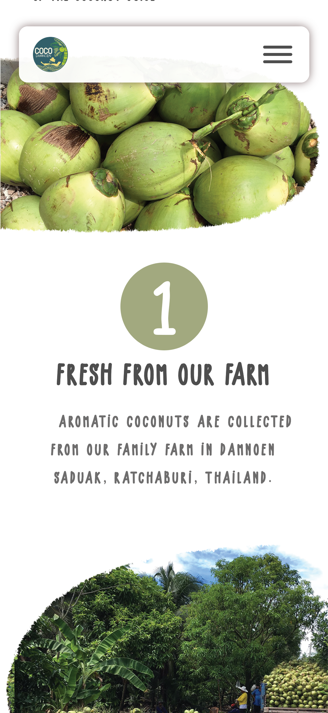

## <h1 align="center">CocoDamnoen</h1>

<p align="center"></p>
<h2 align="center"><a  href="">Live Demo</a></h2>

---

## Description

<h4>this project was designed by © Riseplus Technology. and i build this website with Reactjs. it responsive supported :)</h4>

---

## Desktop version

<p align="center">


</p>

</img>

## Mobile version

<p align="center">

</img>

</p>
<p align="center">

</img>

</p>

---

## Project setup

```
npm install
npm run start
```

---

## Thnk you :)
